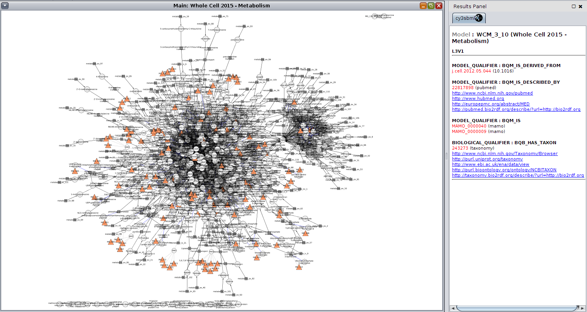

# Metabolism
This page describes how to the metabolism submodules were generated. The submodul metabolism is an FBA model. 
Two models were generate, a `full_model` which corresponds to the Karr Matlab code and a `toy_model`, a simplfied model with the focus on coupling FBA models to the ODE/SSA models.  
All code and scripts for model generation are available from https://github.com/dagwa/wholecell-metabolism  

# toy_model
A toy model for the coupling of ODE/SSA with FBA simulations was generated using SBML and fbc v2 and comp v1. The toy models were generated with the python bindings to `libsbml` and were simulated using python bindings to `cobrapy` and `libroadrunner`. The python scripts for model generation and simulation are available from https://github.com/dagwa/wholecell-metabolism/tree/master/mkoenig/python/metabolism/toymodel

The model consists of multiple SBML submodels which are coupled via comp

`toy_comp.xml` : complete ODE/SSA model consisting of  
* `toy_ode_bounds.xml` : model for calculating flux bounds
* `toy_ode_update.xml` : model for updating nutrient counts based on FBA fluxes
* `toy_ode_model.xml` : arbitrary ODE/SSA model for demonstrating coupling

`toy_fba.xml` : complete FBA model

An overview of the model and a example simulation are provided [here](toy_model/Integrated Toy Model.pdf).

## Simulation ODE/SSA with FBA
The `toy_model` model is simulated by iteratively 
* calculating a step in the ODE/SSA part, which updates the flux bounds and metabolite counts
* sending the flux bounds to the FBA part
* performing FBA with FBA model
* sending the optimal fluxes to the ODE/SSA part
 

# Full model
The annotated SBML was generated from the Matlab source code and the wholecell knowledgebase.
## Model creation
  * TODO
## Model annotation
  * TODO

